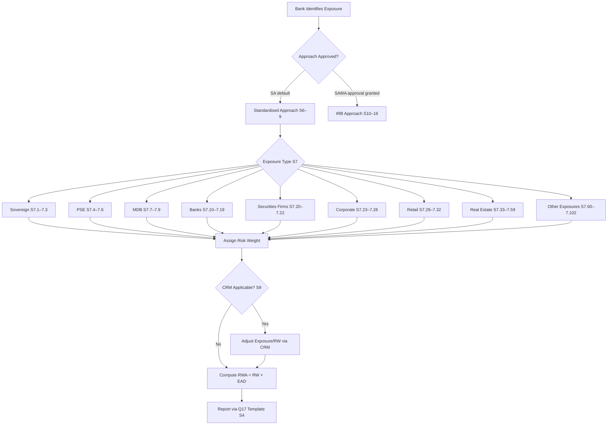
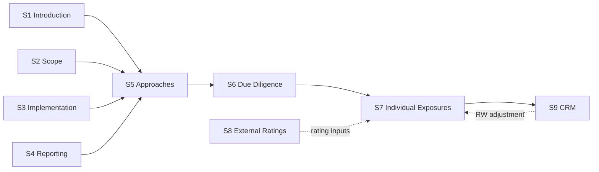

# SAMA Credit Risk Framework

**Minimum Capital Requirements for Credit Risk** — Saudi Central Bank (SAMA), Version 2.1, December 2022  
Implementing Basel III Standardised Approach for credit risk capital adequacy.

---

## What This Is

This knowledge base materialises the SAMA Credit Risk circular into a navigable reference for practitioners. Every clause is preserved verbatim, cross-linked by number, and paired with a decision flowchart so you can answer *"which rule applies here?"* without memorising the document.

**Scope:** Sections 1–9 only (Introduction through Standardised Approach: Credit Risk Mitigation).  
**Legal authority:** Royal Decree M/36 dated 15/04/1428H; Banking Control Law Article 3(A).  
**Effective date:** 01 January 2023.

---

## How to Navigate

| You want to… | Go to… |
|---|---|
| Understand what this regulation covers | [Introduction & Scope](overview/introduction.md) |
| See SAMA reporting obligations | [SAMA Reporting Requirements](overview/sama-requirements.md) |
| Choose between SA and IRB approaches | [Approaches Overview](overview/approaches-overview.md) |
| Find the risk weight for a specific counterparty | [Individual Exposures S7](standardised-approach/individual-exposures.md) |
| Understand ECAI / external rating rules | [External Ratings S8](standardised-approach/external-ratings.md) |
| Apply collateral, guarantees, or netting | [Credit Risk Mitigation S9](standardised-approach/crm.md) |

---

## Framework Overview

---

## Section Map

---

## Quick Reference: Key Risk Weights

| Exposure | Best RW | Worst RW | Key driver |
|---|---|---|---|
| Sovereign (rated) | 0% (AAA–AA−) | 150% (below B−) | External rating |
| Bank ECRA | 20% (AAA–AA−) | 150% (below B−) | Sovereign + bank rating |
| Bank SCRA Grade A | 40% | — | Due diligence |
| Bank SCRA Grade B | 75% | — | Due diligence |
| Bank SCRA Grade C | 150% | — | Due diligence |
| Corporate (rated) | 20% (AAA–AA−) | 150% (below B−) | External rating |
| Corporate (unrated) | 100% | — | General |
| Retail (qualifying) | 75% | — | Granularity test |
| Residential RE (LTV ≤50%) | 20% | — | LTV band |
| CRE (general) | 100% | — | LTV-based floor |

---

*Built with [MkDocs Material](https://squidfunk.github.io/mkdocs-material/). Source: SAMA circular, v2.1, Dec 2022.*
