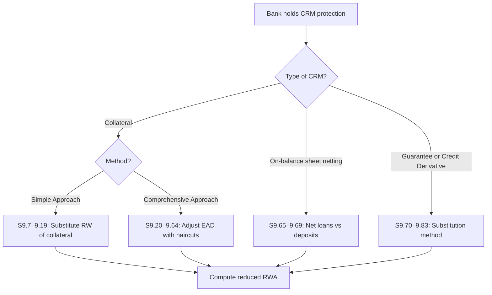
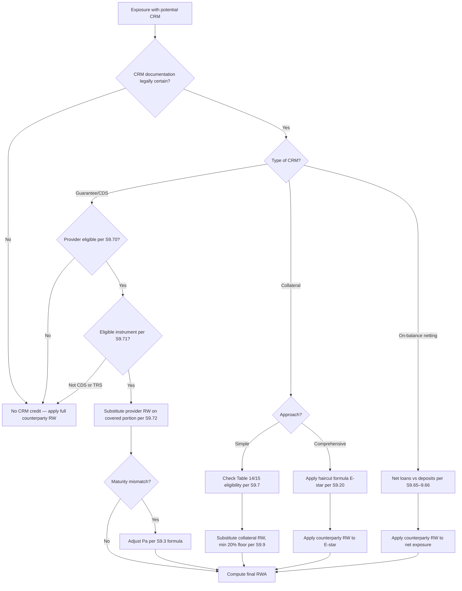

# Credit Risk Mitigation — S9

Section 9 governs how banks may reduce their credit risk capital requirements using collateral, on-balance sheet netting, guarantees, and credit derivatives.

!!! sama "SAMA Note"
    CRM recognition is **not automatic** — legal certainty and documentation standards must be met first (S9.1–9.6). Regulators have seen CRM protection fail in stress due to documentation deficiencies.

---

## CRM Framework Overview



---

## 9.1–9.6 General Requirements for CRM Recognition { #clause-9-1 }

### 9.1 Legal Certainty { #clause-9-1-main }

=== "Clause Text"
    > **9.1** For CRM techniques to be recognised for capital relief purposes, the credit protection must be **legally certain and enforceable** in all relevant jurisdictions. Banks must have conducted sufficient legal review to satisfy themselves of this and undertake further review as necessary.

---

### 9.2 Documentation { #clause-9-2 }

=== "Clause Text"
    > **9.2** All documentation used in collateralised transactions, on-balance sheet netting arrangements, guarantees, and credit derivatives must be **binding on all parties** and legally enforceable. Banks must have conducted adequate due diligence to satisfy themselves of this.

---

### 9.3 Maturity Mismatch { #clause-9-3 }

=== "Clause Text"
    > **9.3** A **maturity mismatch** occurs when the residual maturity of the hedge (CRM protection) is less than the residual maturity of the underlying exposure.
    >
    > The **adjusted value of the protection** when there is a maturity mismatch is:
    >
    > **Pa = P × (t − 0.25) / (T − 0.25)**
    >
    > Where:
    > - Pa = value of the credit protection adjusted for maturity mismatch
    > - P = nominal value of the credit protection
    > - t = min(T, residual maturity of the credit protection arrangement) in years
    > - T = min(5, residual maturity of the exposure) in years

=== "Formula"
    ```
    Pa = P × (t − 0.25) / (T − 0.25)
    
    Example:
    - Exposure maturity T = 3 years
    - Guarantee maturity t = 2 years
    - P = SAR 1,000,000
    
    Pa = 1,000,000 × (2 − 0.25) / (3 − 0.25)
       = 1,000,000 × 1.75 / 2.75
       = SAR 636,364
    ```

---

### 9.4 Minimum Maturity of Hedge { #clause-9-4 }

=== "Clause Text"
    > **9.4** Credit protection with a residual maturity of **less than 3 months** shall not be recognised for capital relief purposes.

---

### 9.5 Currency Mismatch { #clause-9-5 }

=== "Clause Text"
    > **9.5** Where the credit protection is denominated in a currency different from the exposure, a **currency mismatch haircut of 8%** must be applied to the value of the protection (or the standard supervisory haircut, whichever is greater).

---

### 9.6 Over-Collateralisation { #clause-9-6 }

=== "Clause Text"
    > **9.6** Where the value of collateral exceeds the exposure, banks may only recognise CRM benefits up to 100% of the exposure. Excess collateral does not generate additional capital relief.

---

## 9.7–9.19 Simple Approach to Collateral { #clause-9-7 }

### 9.7 Eligible Collateral — Simple Approach { #clause-9-7-main }

=== "Clause Text"
    > **9.7** Under the simple approach, the following financial collateral is eligible:
    >
    > **(a) Cash** on deposit with the lending bank.
    >
    > **(b) Gold** — physical gold.
    >
    > **(c) Debt securities** issued by sovereigns or central banks rated at least BB− by a recognised ECAI (or equivalent if unrated and issued by a bank, exchange-listed, and treated as senior debt).
    >
    > **(d) Debt securities issued by other entities** (PSEs, MDBs, banks, securities firms) rated at least **BBB−** (investment grade).
    >
    > **(e) Equities** (including convertible bonds) included in a main index.
    >
    > **(f) Undertakings for Collective Investment (UCIs)** (mutual funds) where the underlying instruments are one of the above.

=== "Decision Flow"
    ```mermaid
    flowchart TD
        A[Proposed Collateral] --> B{Type?}
        B -- Cash at lending bank --> C[✅ Eligible]
        B -- Gold --> C
        B -- Sovereign/CB debt --> D{Rated ≥ BB-?}
        D -- Yes --> C
        D -- "No: check unrated" --> E{Exchange-listed, senior bank issue?}
        E -- Yes --> C
        E -- No --> F[❌ Not eligible]
        B -- Other debt: PSE/MDB/Bank --> G{Rated ≥ BBB-?}
        G -- Yes --> C
        G -- No --> F
        B -- Equity --> H{Main index constituent?}
        H -- Yes --> C
        H -- No --> F
        B -- UCI/fund --> I{All underlying eligible?}
        I -- Yes --> C
        I -- No --> F
    ```

---

### 9.8 Minimum Holding Period { #clause-9-8 }

=== "Clause Text"
    > **9.8** In the simple approach, the collateral must be pledged for at least the life of the exposure.

---

### 9.9 Risk Weight Substitution { #clause-9-9 }

=== "Clause Text"
    > **9.9** Under the simple approach, the **risk weight of the collateral** (using its own risk weight as a counterparty) is **substituted** for the risk weight of the counterparty on the **collateralised portion** of the exposure.
    >
    > The uncollateralised portion retains the counterparty's risk weight.
    >
    > **Minimum risk weight floor: 20%** (except for specific instruments listed in [S9.10](#clause-9-10)).

=== "Example"
    ```
    Corporate exposure: SAR 1,000,000 → 100% RW
    Collateral: SAR 600,000 in cash (0% RW)
    
    Collateralised portion: SAR 600,000 × max(20%, 0%) = SAR 600,000 × 20%
    Uncollateralised portion: SAR 400,000 × 100%
    
    Total RWA = SAR 120,000 + SAR 400,000 = SAR 520,000
    (vs SAR 1,000,000 without CRM)
    ```

---

### 9.10 Zero Risk Weight Floor Exceptions { #clause-9-10 }

=== "Clause Text"
    > **9.10** The 20% floor does not apply to the following collateralised transactions:
    >
    > - Cash-collateralised transactions (both exposure and collateral in same currency)
    > - Transactions collateralised by sovereign or central bank securities (where sovereign receives 0% RW)
    >
    > In these cases, a risk weight of **0%** may be applied to the collateralised portion.

---

### 9.11–9.19 Simple Approach — Additional Rules { #clause-9-11 }

=== "Clause Text"
    > **9.11** Minimum conditions for simple approach:
    > - The collateral must be revalued **at least every 6 months**.
    > - For equities and bonds, marking to market is required at each revaluation.
    >
    > **9.12** Where a bank uses an eligible UCI as collateral, the risk weight is determined by looking through to the underlying assets and applying the weighted average risk weight.
    >
    > **9.13** Repo-style transactions (with daily remargining) may use comprehensive approach haircuts per S9.22 even when nominally using simple approach logic.
    >
    > **9.14** Collateral that is issued by the counterparty itself (or a related party) is **not eligible** for CRM.
    >
    > **9.15–9.19** (Operational requirements): Banks must have a robust collateral management process, including margin calls, dispute resolution, legal review, and segregation of collateral assets.

---

## 9.20–9.64 Comprehensive Approach to Collateral { #clause-9-20 }

Under the comprehensive approach, banks adjust both the **exposure value** (upward for market/FX risk) and the **collateral value** (downward for volatility) using haircuts, then net the two.

### 9.20 The Comprehensive Approach Formula { #clause-9-20-main }

=== "Clause Text"
    > **9.20** Under the comprehensive approach, the **adjusted exposure amount E*** used for capital calculation is:
    >
    > **E\* = max{0, [E × (1 + He) − C × (1 − Hc − Hfx)]}**
    >
    > Where:
    > - E = current value of the exposure (prior to CRM)
    > - He = haircut appropriate to the exposure (for SFTs with re-use of collateral, or 0 for loans)
    > - C = current value of the collateral received
    > - Hc = haircut appropriate to the collateral
    > - Hfx = haircut for currency mismatch between collateral and exposure (8% if different currencies, or 0)

=== "Formula"
    ```
    E* = max{0, E×(1+He) − C×(1−Hc−Hfx)}
    
    Example:
    - Loan E = SAR 1,000,000 (He = 0, no re-use)
    - Collateral C = SAR 800,000 (equity, Hc = 15%)
    - Same currency (Hfx = 0)
    
    E* = max{0, 1,000,000×1.0 − 800,000×(1−0.15−0)}
       = max{0, 1,000,000 − 800,000×0.85}
       = max{0, 1,000,000 − 680,000}
       = SAR 320,000
    
    RWA = SAR 320,000 × counterparty RW (e.g. 100%)
         = SAR 320,000
    ```

---

### 9.21 Eligible Collateral — Comprehensive Approach { #clause-9-21 }

=== "Clause Text"
    > **9.21** The comprehensive approach accepts the same eligible financial collateral as the simple approach ([S9.7](#clause-9-7-main)), **plus**:
    >
    > - Debt securities rated **B−** to BB+ (for banks and corporates as collateral issuers)
    > - Equities not in main indices but listed on recognised exchanges
    > - Gold (same as simple approach)
    > - UCITS/mutual funds where the underlying is one of the above

---

### 9.22 Standard Supervisory Haircuts { #clause-9-22 }

=== "Clause Text"
    > **9.22** The following standard supervisory haircuts apply (assuming daily mark-to-market, daily remargining, and 10-business-day holding period):
    >
    > **Table 14: Standard supervisory haircuts — Debt securities**
    >
    > | Issuer / Rating | Residual maturity | Haircut |
    > |---|---|---|
    > | Sovereign (0% RW) | ≤1 year | 0.5% |
    > | Sovereign (0% RW) | 1–5 years | 2% |
    > | Sovereign (0% RW) | >5 years | 4% |
    > | Other issuers, rated AA− or better | ≤1 year | 1% |
    > | Other issuers, rated AA− or better | 1–5 years | 3% |
    > | Other issuers, rated AA− or better | >5 years | 6% |
    > | Other issuers, rated A+ to BBB− | ≤1 year | 2% |
    > | Other issuers, rated A+ to BBB− | 1–5 years | 5% |
    > | Other issuers, rated A+ to BBB− | >5 years | 12% |
    > | Eligible bank-issued, unrated | All | 15% |
    >
    > **Table 15: Standard supervisory haircuts — Other assets**
    >
    > | Asset Type | Haircut |
    > |---|---|
    > | Main index equities | 15% |
    > | Other equities (exchange-listed) | 25% |
    > | UCITS / mutual funds | Highest haircut of underlying |
    > | Cash in same currency | 0% |
    > | Gold | 15% |
    > | FX mismatch add-on (Hfx) | 8% |

---

### 9.23 Haircut Scaling Formula { #clause-9-23 }

=== "Clause Text"
    > **9.23** Where the actual holding period differs from the 10-business-day base, or the remargining/revaluation period differs, the haircuts must be scaled using:
    >
    > **H = H₁₀ × √((NR + TM − 1) / 10)**
    >
    > Where:
    > - H₁₀ = haircut at 10-day holding period
    > - NR = actual number of business days between remargining / collateral revaluation
    > - TM = minimum holding period for the transaction type

=== "Formula"
    ```
    H = H₁₀ × √((NR + TM − 1) / 10)
    
    Example (repo with 5-day holding period, daily remargining):
    H₁₀ = 2% (sovereign bond 1–5yr)
    NR = 1 (daily remargining)
    TM = 5 (minimum holding period for repo)
    
    H = 2% × √((1 + 5 − 1) / 10)
      = 2% × √(5/10)
      = 2% × 0.707
      = 1.41%
    ```

---

### 9.24–9.29 Comprehensive Approach — Own-Estimate Haircuts { #clause-9-24 }

=== "Clause Text"
    > **9.24** Banks may use own-estimate haircuts instead of standard supervisory haircuts, subject to SAMA approval. Own estimates require:
    >
    > - At least 1-year of historical data (3-year period recommended)
    > - Stress periods included in the estimation window
    > - Annual backtesting against actual price volatility
    > - Operational independence of the estimation process
    >
    > **9.25** When using own-estimate haircuts, the haircut for a netting set is calculated using the portfolio approach if instruments are correlated.
    >
    > **9.26–9.29** Additional conditions: adequate systems, regular review, external audit of model.

---

### 9.30–9.50 Comprehensive Approach — Repo / SFTs { #clause-9-30 }

=== "Clause Text"
    > **9.30** For repo-style transactions, the comprehensive approach applies with minimum holding periods of:
    >
    > | Transaction type | Minimum holding period (TM) |
    > |---|---|
    > | Repo / reverse repo | 5 business days |
    > | Securities lending / borrowing | 5 business days |
    > | Other capital market-driven transactions | 10 business days |
    >
    > **9.31** For repo transactions with daily mark-to-market and margin calls, and with counterparties that are core market participants, SAMA may allow a 0% haircut on high-quality sovereign bonds.
    >
    > **9.32** Core market participants for S9.31 purposes: sovereigns, central banks, PSEs, banks, securities firms, regulated mutual funds with daily NAV, pension funds, central counterparties.
    >
    > **9.33–9.50** (Operational requirements for SFTs): documentation, legal agreements (GMRA, GMSLA), right of re-use documentation, segregation.

---

### 9.51–9.64 Comprehensive Approach — OTC Derivatives & Netting Sets { #clause-9-51 }

=== "Clause Text"
    > **9.51** For OTC derivative transactions covered by a legally enforceable netting agreement, the exposure E in the comprehensive approach formula is the net replacement cost of the netting set.
    >
    > **9.52** Collateral posted or received against OTC derivatives reduces or increases the net exposure as per S9.20.
    >
    > **9.53–9.64** (Operational requirements): banks must have systems to track collateral daily, manage margin disputes, and document netting agreements (ISDA Master Agreement with CSA).

---

## 9.65–9.69 On-Balance Sheet Netting { #clause-9-65 }

### 9.65 { #clause-9-65-main }

=== "Clause Text"
    > **9.65** Where a bank has a legally enforceable netting agreement with a counterparty covering both loans and deposits, the bank may calculate its capital requirement on the **net** exposure.
    >
    > The netting agreement must:
    > - Be legally enforceable in all relevant jurisdictions
    > - Give the non-defaulting party the right to terminate and net outstanding obligations on default
    > - Include all assets and liabilities in scope

---

### 9.66 Net Exposure Calculation { #clause-9-66 }

=== "Clause Text"
    > **9.66** Where on-balance sheet netting is applied, the net exposure E\* = max{0, Net loans − Net deposits × (1 − Hfx)}, where Hfx is the currency mismatch haircut (8%) if applicable.

---

### 9.67–9.69 On-Balance Sheet Netting — Conditions { #clause-9-67 }

=== "Clause Text"
    > **9.67** Banks must maintain a current legal opinion confirming the enforceability of the netting agreement in each relevant jurisdiction.
    >
    > **9.68** Banks must monitor concentration risk even after netting — if netting produces a large net loan, the gross exposure still creates operational risk.
    >
    > **9.69** The netting agreement must cover the same counterparty on both sides — cross-entity netting within a group is not permitted unless explicitly approved by SAMA.

---

## 9.70–9.83 Guarantees and Credit Derivatives { #clause-9-70 }

### 9.70 Eligible Guarantors { #clause-9-70-main }

=== "Clause Text"
    > **9.70** The following entities are eligible protection providers for guarantee / credit derivative CRM:
    >
    > - Sovereigns and central banks
    > - PSEs
    > - MDBs
    > - Banks with lower risk weight than the obligor
    > - Other entities rated **A−** or better (including parent companies, affiliates, subsidiaries — provided the bank can demonstrate uncorrelated credit risk)

---

### 9.71 Eligible Credit Derivatives { #clause-9-71 }

=== "Clause Text"
    > **9.71** Only the following credit derivative types are eligible for CRM recognition:
    >
    > - **Credit Default Swaps (CDS)**
    > - **Total Return Swaps (TRS)**
    >
    > Other credit-linked instruments (CLNs, synthetic CDOs, first-to-default baskets) are **not eligible** for CRM under the SA unless explicitly permitted.

---

### 9.72 Substitution Approach { #clause-9-72-main }

=== "Clause Text"
    > **9.72** Where a bank has an eligible guarantee or credit derivative, the risk weight of the **protection provider** is **substituted** for the risk weight of the **obligor** on the protected portion of the exposure.
    >
    > This is the **substitution approach**.
    >
    > The unprotected portion retains the obligor's risk weight.

=== "Example"
    ```
    Corporate exposure: SAR 1,000,000 → 100% RW (unrated corporate)
    Guarantee: SAR 700,000 from a sovereign → 0% RW
    
    Protected portion: SAR 700,000 × 0% = SAR 0
    Unprotected portion: SAR 300,000 × 100% = SAR 300,000
    
    Total RWA = SAR 300,000
    (vs SAR 1,000,000 without guarantee)
    ```

=== "Decision Flow"
    ```mermaid
    flowchart TD
        A[Exposure with guarantee/CDS] --> B{Is protection provider eligible per S9.70?}
        B -- No --> C[No CRM — use obligor RW for full amount]
        B -- Yes --> D{Protection covers full exposure?}
        D -- Yes --> E[Apply protector RW to full exposure]
        D -- Partial --> F[Apply protector RW to covered portion]
        F --> G[Apply obligor RW to uncovered portion]
        E & G --> H{Maturity mismatch?}
        H -- Yes --> I[Apply Pa adjustment per S9.3]
        H -- No --> J[Compute RWA = RW × E*]
        I --> J
    ```

---

### 9.73 Double Default { #clause-9-73 }

=== "Clause Text"
    > **9.73** Under the substitution approach, the capital benefit is recognised only on the assumption of a single default (either obligor or guarantor). Banks using the SA do not receive credit for "double default" effects.

---

### 9.74 Conditional Guarantees { #clause-9-74 }

=== "Clause Text"
    > **9.74** For a guarantee to qualify for CRM, it must be:
    >
    > - **Direct** — a direct obligation of the protection provider
    > - **Explicit** — covering specific obligations
    > - **Irrevocable** — not subject to cancellation by the guarantor
    > - **Unconditional** — no clause allows the guarantor to avoid payment based on the obligor's actions

---

### 9.75–9.78 CDS-Specific Requirements { #clause-9-75 }

=== "Clause Text"
    > **9.75** For CDS to qualify, the reference obligation in the CDS must match the hedged exposure (or the bank must demonstrate that the reference obligation and hedged exposure are sufficiently close).
    >
    > **9.76** A CDS protecting against restructuring-only events (soft/full restructuring definitions under ISDA) may receive partial credit depending on the ISDA documentation used.
    >
    > **9.77** If the CDS seller (protection buyer from the bank's perspective) is the same entity as the reference entity, no CRM benefit is recognised.
    >
    > **9.78** Unilateral break clauses or material adverse change clauses that could allow the guarantor/protection seller to terminate the CDS do not qualify for CRM.

---

### 9.79–9.81 Sovereign Counter-Guarantees { #clause-9-79 }

=== "Clause Text"
    > **9.79** Where a guarantee is counter-guaranteed by a sovereign or central bank, the bank may treat the exposure as directly guaranteed by the sovereign, subject to:
    >
    > - The sovereign counter-guarantee covers all credit risk elements of the original guarantee.
    > - The original guarantee is a direct, explicit, irrevocable, unconditional obligation of the first guarantor.
    > - The counter-guarantee meets the same standards.
    >
    > **9.80** The sovereign counter-guarantee must be denominated in the currency of the original exposure, or the Hfx haircut applies.
    >
    > **9.81** SAMA may allow a 0% risk weight on exposures counter-guaranteed by the Saudi government in SAR.

---

### 9.82–9.83 Residual Risks { #clause-9-82 }

=== "Clause Text"
    > **9.82** Banks must recognise and manage residual risks associated with CRM, including:
    >
    > - **Legal risk** — enforceability failure
    > - **Liquidity risk** — inability to realise collateral quickly
    > - **Correlation risk** — collateral value declines when counterparty defaults ("wrong-way risk")
    > - **Concentration risk** — over-reliance on a single protection provider
    >
    > **9.83** Banks must have policies and procedures to address each of these residual risks. SAMA may require additional capital charges where residual risks are not adequately managed.

---

## CRM Decision Tree — End-to-End



---

## Cross-References

- [S7.34–7.39 RRE LTV tables](individual-exposures.md#clause-7-34) — CRM can supplement but not replace LTV-based RW
- [S7.63 Defaulted exposures](individual-exposures.md#clause-7-63) — provisions reduce RW independently of CRM
- [S8 External ratings](external-ratings.md) — ECAI ratings needed for eligible debt collateral in S9.7
- [S6 Due diligence](../overview/approaches-overview.md#clause-6) — underpins SCRA grading for bank guarantors
