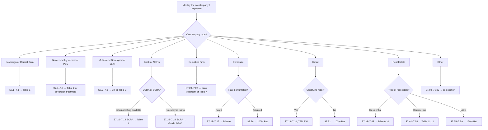

# Standardised Approach

The Standardised Approach (SA) assigns risk weights to credit exposures based on counterparty type and — where available — external credit ratings.

---

## Master Exposure-Type Selector

Use this flowchart to identify which section of S7 governs your exposure:

---

## Sections in This Chapter

| Section | Content |
|---|---|
| [Individual Exposures S7](individual-exposures.md) | All 13 exposure sub-categories, 12 risk weight tables |
| [External Ratings S8](external-ratings.md) | ECAI eligibility, rating mapping, multiple ratings rules |
| [Credit Risk Mitigation S9](crm.md) | Collateral, guarantees, netting — simple and comprehensive |
