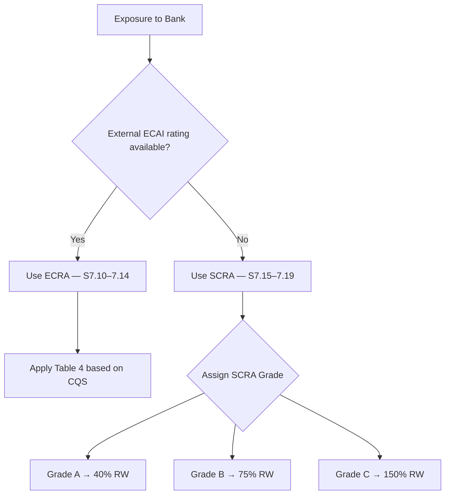
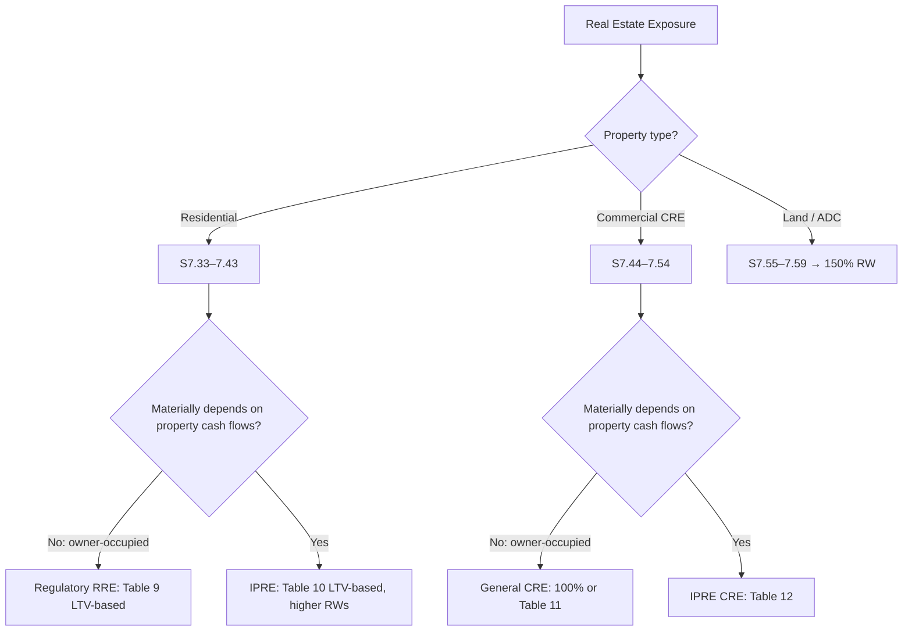

# Individual Exposures — S7

Section 7 assigns specific risk weights to each counterparty and exposure type under the Standardised Approach. All 13 sub-categories are covered here.

!!! tip "How to use this page"
    Use Ctrl+F / ⌘+F to jump to a clause number (e.g. "7.29"), or use the table of contents on the right. Each sub-section has both the verbatim clause text and a decision flowchart.

---

## 7.1–7.3 Exposures to Sovereigns and Central Banks { #clause-7-1 }

### 7.1 { #clause-7-1-main }

=== "Clause Text"
    > **7.1** Exposures to sovereigns and their central banks will be risk-weighted based on the external rating of the sovereign, as per Table 1 below.
    >
    > **Table 1: Risk weights for sovereigns and central banks**
    >
    > | External rating | AAA to AA− | A+ to A− | BBB+ to BBB− | BB+ to B− | Below B− | Unrated |
    > |---|---|---|---|---|---|---|
    > | Risk weight | 0% | 20% | 50% | 100% | 150% | 100% |

=== "Decision Flow"
    ```mermaid
    flowchart TD
        A[Exposure to Sovereign or Central Bank?] --> B{External rating available?}
        B -- No --> G[100% RW — Unrated]
        B -- Yes --> C{Rating band?}
        C -- AAA to AA- --> D[0% RW]
        C -- A+ to A- --> E[20% RW]
        C -- BBB+ to BBB- --> F[50% RW]
        C -- BB+ to B- --> H[100% RW]
        C -- Below B- --> I[150% RW]
    ```

---

### 7.2 SAR-Denominated Exposures to Saudi Government { #clause-7-2 }

=== "Clause Text"
    > **7.2** Exposures to the Saudi Government or the Saudi Central Bank (SAMA) denominated and funded in Saudi Riyals (SAR) may be assigned a **0% risk weight** at the discretion of SAMA.

=== "Key Point"
    This is the sovereign preferential treatment for domestic currency exposures — a standard Basel III option exercised by SAMA. Only SAR-denominated **and** SAR-funded positions qualify.

---

### 7.3 Multilateral Institutions as Sovereigns { #clause-7-3 }

=== "Clause Text"
    > **7.3** Exposures to the Bank for International Settlements (BIS), the International Monetary Fund (IMF), the European Central Bank (ECB), the European Union (EU), and the European Stability Mechanism (ESM) may be assigned a **0% risk weight**.

---

## 7.4–7.6 Exposures to Non-Central-Government PSEs { #clause-7-4 }

### 7.4 { #clause-7-4-main }

=== "Clause Text"
    > **7.4** For exposures to domestic non-central-government public sector entities (PSEs), national supervisors may treat these exposures either as:
    >
    > (a) Exposures to the sovereign of the country in which the PSE is established; or  
    > (b) Exposures to banks operating in that country.
    >
    > SAMA will determine which treatment applies to Saudi domestic PSEs.

=== "Decision Flow"
    ```mermaid
    flowchart TD
        A[Exposure to PSE] --> B{SAMA-designated treatment?}
        B -- Sovereign treatment --> C[Apply Table 1 sovereign RW based on sovereign rating]
        B -- Bank treatment --> D{ECRA or SCRA?}
        D -- External rating --> E[Apply Table 4 bank ECRA RW]
        D -- No rating --> F[Apply SCRA Grade A/B/C]
    ```

---

### 7.5 Foreign PSE Treatment { #clause-7-5 }

=== "Clause Text"
    > **7.5** Exposures to foreign PSEs should generally be treated as exposures to banks operating in the country where the PSE is established, unless the foreign country's supervisor has explicitly chosen sovereign treatment and the host supervisor concurs.

---

### 7.6 Preferential Short-Term Treatment { #clause-7-6 }

=== "Clause Text"
    > **7.6** Where bank treatment is applied to a PSE, the preferential short-term risk weight treatment available to banks (see [S7.18](#clause-7-18)) may also be applied.

---

## 7.7–7.9 Exposures to Multilateral Development Banks { #clause-7-7 }

### 7.7 Eligible MDBs — 0% Risk Weight { #clause-7-7-main }

=== "Clause Text"
    > **7.7** The following MDBs are eligible for a **0% risk weight**:
    >
    > - World Bank Group (IBRD, IDA, IFC, MIGA)
    > - Asian Development Bank (ADB)
    > - African Development Bank (AfDB)
    > - European Bank for Reconstruction and Development (EBRD)
    > - Inter-American Development Bank (IADB)
    > - European Investment Bank (EIB)
    > - European Investment Fund (EIF)
    > - Nordic Investment Bank (NIB)
    > - Caribbean Development Bank (CDB)
    > - Islamic Development Bank (IsDB)
    > - Council of Europe Development Bank (CEB)

=== "Key Point"
    These institutions receive 0% because they have the highest credit quality, callable capital from sovereign shareholders, and prudent lending practices as assessed by BCBS.

---

### 7.8 Other MDBs — Rated Treatment { #clause-7-8 }

=== "Clause Text"
    > **7.8** For MDBs not listed in S7.7, the following risk weights apply based on external rating, as per Table 3 below.
    >
    > **Table 3: Risk weights for other MDBs**
    >
    > | External rating | AAA to AA− | A+ to A− | BBB+ to BBB− | BB+ to B− | Below B− | Unrated |
    > |---|---|---|---|---|---|---|
    > | Risk weight | 20% | 30% | 50% | 100% | 150% | 50% |

---

### 7.9 { #clause-7-9 }

=== "Clause Text"
    > **7.9** Where a bank's exposure to an MDB has a specific short-term rating, the short-term rating mapping in Table 13 ([S7.18](#clause-7-18)) applies.

---

## 7.10–7.19 Exposures to Banks { #clause-7-10 }

Banks can be assessed via two methods: **ECRA** (External Credit Risk Assessment Approach) when an external rating is available, or **SCRA** (Standardised Credit Risk Assessment Approach) when no external rating exists.



### 7.10 ECRA — External Credit Risk Assessment Approach { #clause-7-10-main }

=== "Clause Text"
    > **7.10** Where an external rating is available for a bank, the risk weight should be determined based on the external rating using Table 4 below.
    >
    > **Table 4: Risk weights for banks (ECRA)**
    >
    > | External rating | AAA to AA− | A+ to A− | BBB+ to BBB− | BB+ to B− | Below B− | Unrated |
    > |---|---|---|---|---|---|---|
    > | Risk weight | 20% | 30% | 50% | 100% | 150% | 50% |

---

### 7.11 ECRA — Sovereign Floor { #clause-7-11 }

=== "Clause Text"
    > **7.11** Under the ECRA, the risk weight for an exposure to a bank must not be lower than the risk weight applicable to an exposure to the sovereign of the country where the bank is incorporated.

=== "Key Point"
    Banks cannot be rated better than their home sovereign. If the sovereign gets 50% RW, a bank in that country gets at least 50% regardless of its own rating.

---

### 7.12 ECRA — Preferential Treatment for Short-Term Exposures { #clause-7-12 }

=== "Clause Text"
    > **7.12** For short-term self-liquidating trade transactions with an original maturity of **3 months or less**, a preferential short-term risk weight may apply based on the bank's short-term rating (see [S7.18](#clause-7-18), Table 13).

---

### 7.13 ECRA — Original Maturity ≤3 Months { #clause-7-13 }

=== "Clause Text"
    > **7.13** For interbank exposures with an original maturity of 3 months or less, the applicable risk weight (under ECRA) is one category more favourable than the long-term risk weight, subject to a floor of 20%.
    >
    > **Table 5: Short-term preferential risk weights for banks (ECRA)**
    >
    > | Long-term external rating | AAA to AA− | A+ to A− | BBB+ to BBB− | BB+ to B− | Below B− | Unrated |
    > |---|---|---|---|---|---|---|
    > | Short-term RW | 20% | 20% | 20% | 50% | 150% | 20% |

---

### 7.14 ECRA — Original Maturity >3 Months { #clause-7-14 }

=== "Clause Text"
    > **7.14** For exposures to banks with original maturity exceeding 3 months, use Table 4 (long-term ECRA) as stated in [S7.10](#clause-7-10-main).

---

### 7.15 SCRA — Grades { #clause-7-15 }

=== "Clause Text"
    > **7.15** Where no external rating is available for a bank, the bank must be assessed using the Standardised Credit Risk Assessment Approach (SCRA) and assigned to one of the following grades:
    >
    > - **Grade A**: The bank meets or exceeds applicable regulatory capital and liquidity requirements, and there are no material regulatory concerns about the bank's risk management practices.
    > - **Grade B**: The bank does not qualify for Grade A and does not qualify for Grade C.
    > - **Grade C**: The bank has significant regulatory concerns, including potential breach of regulatory capital/liquidity requirements or is in financial distress.

=== "Decision Flow"
    ```mermaid
    flowchart TD
        A[SCRA Assessment] --> B{Meets/exceeds regulatory capital AND liquidity?}
        B -- "Meets capital + liquidity, no concerns" --> C[Grade A, 40% RW]
        B -- No/partial --> D{Significant concerns or distress?}
        D -- Yes --> E[Grade C, 150% RW]
        D -- No --> F[Grade B, 75% RW]
    ```

---

### 7.16 SCRA — Risk Weights { #clause-7-16 }

=== "Clause Text"
    > **7.16** The following risk weights apply under the SCRA:
    >
    > | SCRA Grade | Risk Weight |
    > |---|---|
    > | Grade A | 40% |
    > | Grade B | 75% |
    > | Grade C | 150% |

---

### 7.17 SCRA — Sovereign Floor { #clause-7-17 }

=== "Clause Text"
    > **7.17** Under the SCRA, the risk weight for an exposure to a bank must not be lower than the risk weight applicable to an exposure to the sovereign of the country where the bank is incorporated. This means that the Grade A risk weight of 40% is subject to the sovereign floor.

---

### 7.18 SCRA — Short-Term Exposures { #clause-7-18 }

=== "Clause Text"
    > **7.18** For short-term exposures to SCRA-graded banks with an original maturity of 3 months or less, the following preferential risk weights apply:
    >
    > | SCRA Grade | Short-term RW (≤3 months) |
    > |---|---|
    > | Grade A | 20% |
    > | Grade B | 50% |
    > | Grade C | 150% |
    >
    > **Table 13: Short-term claim risk weights (ECRA/SCRA)**
    >
    > | S&P | Moody's | Fitch | Risk Weight |
    > |---|---|---|---|
    > | A-1+ / A-1 | P-1 | F1+ / F1 | 20% |
    > | A-2 | P-2 | F2 | 50% |
    > | A-3 | P-3 | F3 | 100% |
    > | Below A-3 | NP | Below F3 | 150% |

---

### 7.19 SCRA — Due Diligence Requirement { #clause-7-19 }

=== "Clause Text"
    > **7.19** When assigning SCRA grades, banks must conduct adequate due diligence as required under [S6](../overview/approaches-overview.md#clause-6) and must be able to demonstrate this to SAMA. If a bank cannot adequately perform the due diligence, it must assign Grade C.

---

## 7.20–7.22 Exposures to Securities Firms and Other Financial Institutions { #clause-7-20 }

### 7.20 { #clause-7-20-main }

=== "Clause Text"
    > **7.20** Exposures to securities firms and other financial institutions shall be treated as exposures to banks, provided the firms are subject to prudential standards and supervision equivalent to those applied to banks (including capital and liquidity requirements).

---

### 7.21 { #clause-7-21 }

=== "Clause Text"
    > **7.21** If a securities firm or financial institution is not subject to equivalent prudential supervision, the exposure shall be treated as a corporate exposure.

---

### 7.22 { #clause-7-22 }

=== "Clause Text"
    > **7.22** Exposures to unregulated financial entities shall be treated as corporate exposures.

=== "Decision Flow"
    ```mermaid
    flowchart TD
        A[Exposure to Securities Firm / Financial Institution] --> B{Subject to equivalent prudential supervision?}
        B -- "Yes: equivalent supervision" --> C[Treat as bank per S7.10–7.19]
        B -- No --> D[Treat as corporate exposure per S7.23–7.28]
    ```

---

## 7.23–7.28 Exposures to Corporates { #clause-7-23 }

### 7.23 Rated Corporates { #clause-7-23-main }

=== "Clause Text"
    > **7.23** For exposures to rated corporate counterparties, the risk weight shall be determined as per Table 6 below.
    >
    > **Table 6: Risk weights for rated corporates**
    >
    > | External rating | AAA to AA− | A+ to A− | BBB+ to BBB− | BB+ to B− | Below B− |
    > |---|---|---|---|---|---|
    > | Risk weight | 20% | 50% | 75% | 100% | 150% |

---

### 7.24 Unrated Corporates { #clause-7-24 }

=== "Clause Text"
    > **7.24** For exposures to unrated corporate counterparties, a risk weight of **100%** shall be applied, unless the corporate exposure qualifies for a higher or lower risk weight elsewhere (e.g. SME treatment or as a specialised lending exposure).

---

### 7.25 Corporate Sovereign Floor { #clause-7-25 }

=== "Clause Text"
    > **7.25** The risk weight assigned to a corporate exposure must not be lower than the risk weight applicable to the sovereign of the country of incorporation.

---

### 7.26 SME Corporate Exposures { #clause-7-26 }

=== "Clause Text"
    > **7.26** Exposures to small and medium-sized enterprises (SMEs) that do not meet the criteria for retail treatment (see [S7.29](#clause-7-29)) shall be risk-weighted at **85%**, provided the total exposure to the SME group does not exceed SAR 50 million.

=== "Key Point"
    SME corporate = corporate-type counterparty, too large for retail granularity, but benefits from a slight reduction from 100% general corporate to 85%.

---

### 7.27 Specialised Lending { #clause-7-27 }

=== "Clause Text"
    > **7.27** Specialised lending exposures (project finance, object finance, commodities finance, income-producing real estate) shall be risk-weighted as follows if no external rating is available:
    >
    > | Sub-category | Risk Weight |
    > |---|---|
    > | Strong | 70% |
    > | Good | 90% |
    > | Satisfactory | 115% |
    > | Weak | 250% |
    > | Default | 0% (net of provisions) |

---

### 7.28 General Corporate Decision Flow { #clause-7-28 }

=== "Decision Flow"
    ```mermaid
    flowchart TD
        A[Corporate Exposure] --> B{External rating?}
        B -- Rated --> C[Apply Table 6 RW by rating band]
        B -- Unrated --> D{SME? Total exposure up to SAR 50M?}
        D -- "Yes, SME: check retail" --> E{Meets retail criteria S7.29?}
        E -- Yes --> F[Retail 75% per S7.29]
        E -- No --> G[SME corporate 85%]
        D -- No --> H[General corporate 100%]
        C --> I{Below sovereign RW floor?}
        H --> I
        I -- Yes --> J[Apply sovereign floor]
        I -- No --> K[Apply calculated RW]
    ```

---

## 7.29–7.32 Retail Exposures { #clause-7-29 }

### 7.29 Qualifying Retail — Criteria { #clause-7-29-main }

=== "Clause Text"
    > **7.29** A retail exposure qualifies for the 75% risk weight if it meets all four of the following criteria:
    >
    > 1. **Orientation criterion** — The exposure is to an individual person or persons, or to a small business.
    > 2. **Product criterion** — The exposure takes the form of revolving credits, lines of credit, personal term loans, leases, or small business facilities.
    > 3. **Low value criterion** — The maximum aggregated exposure to one counterparty does not exceed SAR 4.5 million (or equivalent).
    > 4. **Granularity criterion** — No single aggregated exposure exceeds 0.2% of the overall retail portfolio.

=== "Decision Flow"
    ```mermaid
    flowchart TD
        A[Possible Retail Exposure] --> B{Individual or small business?}
        B -- No --> C[Not qualifying retail → S7.32 100% or corporate]
        B -- Yes --> D{Qualifying product type?}
        D -- No --> C
        D -- Yes --> E{Aggregate exposure ≤ SAR 4.5M?}
        E -- No --> C
        E -- Yes --> F{Single exposure ≤ 0.2% of retail portfolio?}
        F -- No --> C
        F -- Yes --> G[✅ Qualifying Retail → 75% RW]
    ```

---

### 7.30 Retail — 75% Risk Weight { #clause-7-30 }

=== "Clause Text"
    > **7.30** Qualifying retail exposures as defined in [S7.29](#clause-7-29-main) shall be assigned a risk weight of **75%**.

---

### 7.31 Retail — Transactors { #clause-7-31 }

=== "Clause Text"
    > **7.31** For credit card and other revolving retail exposures where the obligor repays the full outstanding balance each month ("transactors"), a risk weight of **45%** applies.

=== "Key Point"
    Transactors have no residual credit risk month-to-month; the 45% rate reflects this lower risk profile versus revolving borrowers who carry a balance.

---

### 7.32 Non-Qualifying Retail { #clause-7-32 }

=== "Clause Text"
    > **7.32** Retail exposures that do not meet all four criteria in [S7.29](#clause-7-29-main) shall be treated as corporate exposures and risk-weighted accordingly (generally 100% if unrated).

---

## 7.33–7.59 Real Estate Exposures { #clause-7-33 }

Real estate is split into three major categories: **residential** (S7.33–7.43), **commercial** (S7.44–7.54), and **land acquisition, development, and construction (ADC)** (S7.55–7.59).



---

### 7.33 Residential Real Estate — Scope { #clause-7-33 }

=== "Clause Text"
    > **7.33** The treatment of exposures secured by residential real estate (RRE) depends on whether the repayment materially depends on cash flows generated by the property (income-producing real estate, IPRE) or does not (owner-occupied or second homes).

---

### 7.34 RRE — Whole Loan Approach { #clause-7-34 }

=== "Clause Text"
    > **7.34** For exposures secured by RRE that do **not** materially depend on the property's cash flows, risk weights are applied to the **entire exposure** (whole loan) based on the loan-to-value (LTV) ratio as per Table 9 below.
    >
    > **Table 9: Risk weights for RRE (whole loan, not IPRE)**
    >
    > | LTV ratio | ≤50% | 50–60% | 60–80% | 80–90% | 90–100% | >100% |
    > |---|---|---|---|---|---|---|
    > | Risk weight | 20% | 25% | 30% | 40% | 50% | 70% |

---

### 7.35 RRE — LTV Calculation { #clause-7-35 }

=== "Clause Text"
    > **7.35** The LTV ratio is calculated as the outstanding loan amount divided by the value of the property at origination (or most recent valuation if required by the supervisor). The value must be determined by an independent qualified appraiser.

---

### 7.36 RRE — Loan Splitting Approach { #clause-7-36 }

=== "Clause Text"
    > **7.36** As an alternative to the whole loan approach in [S7.34](#clause-7-34), banks may apply a **loan splitting approach**: the portion of the loan up to 55% of the property value is risk-weighted at 20%, and the remaining portion is risk-weighted as an unsecured exposure to the counterparty.

---

### 7.37 RRE — IPRE { #clause-7-37 }

=== "Clause Text"
    > **7.37** For RRE exposures where repayment materially depends on the cash flows generated by the property (IPRE), risk weights are assigned based on the LTV ratio as per Table 10 below.
    >
    > **Table 10: Risk weights for RRE IPRE**
    >
    > | LTV ratio | ≤60% | 60–80% | >80% |
    > |---|---|---|---|
    > | Risk weight | 30% | 35% | 45% |

---

### 7.38 RRE — Completed vs Under Construction { #clause-7-38 }

=== "Clause Text"
    > **7.38** The preferential risk weights in Tables 9 and 10 apply only to **completed** residential properties. Properties under construction are treated as ADC exposures under [S7.55](#clause-7-55) unless specific conditions are met.

---

### 7.39 RRE — Conditions for Preferential Treatment { #clause-7-39 }

=== "Clause Text"
    > **7.39** The preferential risk weights in Table 9 apply only where the following conditions are met:
    >
    > - The property must be fully completed.
    > - The legal title is registered in the name of the mortgagor.
    > - The bank holds a first-priority mortgage lien or equivalent legal protection.
    > - The property value is not materially dependent on the borrower's performance.

---

### 7.40–7.43 RRE — Flood & Other Conditions { #clause-7-40 }

=== "Clause Text"
    > **7.40** Where supervisors allow a 0% RW for RRE exposures denominated in local currency and the sovereign also receives 0% RW under [S7.2](#clause-7-2), the 0% may be applied to SAR-denominated exposures secured by Saudi residential property.
    >
    > **7.41** Supervisors may increase the risk weights for RRE if they judge that the risk weights in Tables 9 or 10 are too low for the conditions prevailing in their jurisdiction.
    >
    > **7.42** Banks must reassess LTV ratios where the market value of the property has declined materially.
    >
    > **7.43** A bank must have a documented policy for RRE valuation, including criteria for triggering revaluation.

---

### 7.44 Commercial Real Estate — Scope { #clause-7-44 }

=== "Clause Text"
    > **7.44** Commercial real estate (CRE) encompasses all real estate that is not residential. Exposures secured by CRE are risk-weighted based on whether the repayment materially depends on the property's cash flows.

---

### 7.45 CRE — General Treatment { #clause-7-45 }

=== "Clause Text"
    > **7.45** For CRE exposures that do **not** materially depend on the property's cash flows (owner-occupied or investment-grade tenants), the risk weight is the **higher** of:
    >
    > (a) 60%; or  
    > (b) The risk weight that would apply to an unsecured exposure to the counterparty.

=== "Key Point"
    CRE does not get a full credit for collateral under the general approach — the floor is 60% even with strong collateral.

---

### 7.46 CRE — LTV-Based Table { #clause-7-46 }

=== "Clause Text"
    > **7.46** As an alternative to [S7.45](#clause-7-45), where supervisors permit, banks may apply a whole-loan LTV-based approach using Table 11 below.
    >
    > **Table 11: Risk weights for CRE (whole loan, general)**
    >
    > | LTV ratio | ≤60% | 60–80% | >80% |
    > |---|---|---|---|
    > | Risk weight | 60% | 75% | 100% |

---

### 7.47 CRE — IPRE { #clause-7-47 }

=== "Clause Text"
    > **7.47** For CRE exposures where repayment materially depends on the property's cash flows (CRE IPRE), risk weights are assigned based on Table 12 below.
    >
    > **Table 12: Risk weights for CRE IPRE**
    >
    > | LTV ratio | ≤60% | 60–80% | >80% |
    > |---|---|---|---|
    > | Risk weight | 70% | 90% | 110% |

---

### 7.48–7.54 CRE — Additional Conditions { #clause-7-48 }

=== "Clause Text"
    > **7.48** The same conditions that apply to RRE under [S7.39](#clause-7-39) must be met for CRE preferential treatment (first lien, completed property, legal title registered, independent valuation).
    >
    > **7.49** Supervisors may increase CRE risk weights above the Table 11/12 floors.
    >
    > **7.50** Banks must reassess LTV for CRE as required and maintain documented valuation policies.
    >
    > **7.51** CRE exposures secured by retail properties (shopping centres, strip malls) must be assessed for IPRE vs. general treatment.
    >
    > **7.52** Mixed-use properties should be assessed by the primary use of the property.
    >
    > **7.53** For construction-phase CRE, the ADC treatment in [S7.55](#clause-7-55) applies.
    >
    > **7.54** Subordinate liens (second mortgages) on CRE do not qualify for preferential LTV treatment; they are treated as unsecured corporate exposures.

---

### 7.55 ADC — Land Acquisition, Development & Construction { #clause-7-55 }

=== "Clause Text"
    > **7.55** Exposures for land acquisition, development, and construction (ADC), including construction loans, shall be assigned a risk weight of **150%**.

---

### 7.56 ADC — Exception for Residential { #clause-7-56 }

=== "Clause Text"
    > **7.56** ADC exposures for residential real estate may be assigned a risk weight of **100%** where:
    >
    > - The borrower has pre-sold a substantial proportion of the units (at least 50% of units with binding purchase agreements); or
    > - The borrower has equity at risk of at least 25% of the completed property value.

=== "Decision Flow"
    ```mermaid
    flowchart TD
        A[ADC Residential Loan] --> B{≥50% pre-sold with binding contracts?}
        B -- Yes --> C[100% RW]
        B -- No --> D{Borrower equity ≥ 25% of completed value?}
        D -- Yes --> C
        D -- No --> E[150% RW — general ADC]
    ```

---

### 7.57–7.59 ADC — Other Provisions { #clause-7-57 }

=== "Clause Text"
    > **7.57** For ADC exposures that are not residential, the 150% risk weight applies in all cases.
    >
    > **7.58** Once construction is complete and the property transitions to a completed RRE or CRE, the bank should reassign the risk weight based on the applicable RRE or CRE table.
    >
    > **7.59** Banks must document the conditions under which they monitor and reclassify ADC exposures.

---

## 7.60–7.102 Other Exposures { #clause-7-60 }

### 7.60–7.62 Subordinated Debt, Equity, and Capital Instruments { #clause-7-60-main }

=== "Clause Text"
    > **7.60** Exposures in the form of subordinated debt, equity, or other capital instruments issued by corporates or banks (other than regulatory capital deductions) shall be assigned a minimum risk weight of **100%**.
    >
    > **7.61** Equity exposures to banks or securities firms shall be risk-weighted at **250%** unless they are deducted from capital.
    >
    > **7.62** Equity exposures to significant investments in financial institutions that are not consolidated shall be risk-weighted at **250%**.

---

### 7.63–7.65 Defaulted Exposures { #clause-7-63 }

=== "Clause Text"
    > **7.63** An exposure is in **default** when either or both of the following have occurred:
    >
    > - The bank considers that the obligor is unlikely to pay its credit obligations in full.
    > - The obligor is past due **90 days** on any material credit obligation.
    >
    > **7.64** For defaulted exposures, the risk weight is:
    >
    > - **100%** if specific provisions are ≥ 20% of the outstanding exposure
    > - **50%** if specific provisions are ≥ 50% of the outstanding exposure
    > - **150%** where no provisions have been set
    >
    > **7.65** The risk weight of a defaulted exposure secured by residential real estate is:
    >
    > - **100%** if provisions ≥ 20%
    > - **50%** if provisions ≥ 50%

=== "Decision Flow"
    ```mermaid
    flowchart TD
        A[Defaulted Exposure] --> B{Specific provisions as % of outstanding?}
        B -- < 20% provisions --> C[150% RW]
        B -- ≥ 20% provisions --> D[100% RW]
        B -- ≥ 50% provisions --> E[50% RW]
        A --> F{Secured by RRE?}
        F -- Yes + ≥ 20% provisions --> G[100% RW]
        F -- Yes + ≥ 50% provisions --> H[50% RW]
    ```

---

### 7.66–7.68 Off-Balance Sheet Items { #clause-7-66 }

=== "Clause Text"
    > **7.66** Off-balance sheet items are converted to credit exposure equivalents (EAD) using the **Credit Conversion Factor (CCF)** before applying risk weights.
    >
    > **7.67** The following CCFs apply:
    >
    > | Instrument | CCF |
    > |---|---|
    > | Direct credit substitutes (guarantees, acceptances) | 100% |
    > | Transaction-related contingent items | 50% |
    > | Short-term self-liquidating trade letters of credit | 20% |
    > | Commitments (original maturity > 1 year) | 40% |
    > | Commitments (original maturity ≤ 1 year or unconditionally cancellable) | 10% |
    > | Note issuance facilities / revolving underwriting facilities | 75% |
    >
    > **7.68** The CCF-adjusted amount is then risk-weighted using the applicable risk weight for the counterparty.

---

### 7.69–7.72 Derivatives { #clause-7-69 }

=== "Clause Text"
    > **7.69** For OTC derivative exposures (not centrally cleared), the exposure at default (EAD) is calculated as:
    >
    > **EAD = Replacement Cost (RC) + PFE**
    >
    > where PFE is the Potential Future Exposure add-on per the SA-CCR framework.
    >
    > **7.70** Centrally cleared derivatives attract a risk weight of **2%** for qualifying central counterparties (QCCPs) and **4%** for non-qualifying CCPs.
    >
    > **7.71** The risk weight applicable to the counterparty type (sovereign, bank, corporate) applies to the EAD calculated for OTC derivatives.
    >
    > **7.72** Banks may apply CRM techniques (collateral, netting) to reduce EAD per [S9](crm.md).

---

### 7.73–7.75 Repo / SFTs { #clause-7-73 }

=== "Clause Text"
    > **7.73** Securities financing transactions (SFTs: repos, reverse repos, securities lending) are subject to counterparty credit risk and specific rules.
    >
    > **7.74** For SFTs with banks or corporates, the risk weight is the counterparty risk weight applied to the net exposure after collateral (using standard haircuts from [S9.22](crm.md#clause-9-22)).
    >
    > **7.75** The credit exposure for an SFT = max{0, Market Value of Securities Lent − Market Value of Collateral Received × (1 − applicable haircut)}

---

### 7.76–7.78 Covered Bonds { #clause-7-76 }

=== "Clause Text"
    > **7.76** Covered bonds issued by banks and subject to supervision may receive a preferential risk weight.
    >
    > **7.77** The risk weight depends on the issuing bank's external rating and the cover pool quality, as follows:
    >
    > | Issuing bank long-term rating | Covered bond risk weight |
    > |---|---|
    > | AAA to AA− | 10% |
    > | A+ to A− | 20% |
    > | BBB+ to BBB− | 20% |
    > | BB+ to BB− | 50% |
    > | Below BB− | 100% |
    >
    > **7.78** For covered bonds issued by unrated banks, the risk weight is 20%.

---

### 7.79–7.83 Exposures to Clearing Members and CCPs { #clause-7-79 }

=== "Clause Text"
    > **7.79** Exposures arising from client clearing activities (bank as clearing member) attract the risk weight of the CCP if it is a QCCP (2%), or the standard counterparty risk weight if not.
    >
    > **7.80** Initial margin posted to a QCCP: 2% RW.
    >
    > **7.81** Default fund contributions to QCCPs: calculated per the BCBS CCP framework (typically higher than 2%).
    >
    > **7.82** Exposures to non-qualifying CCPs are treated as exposures to the relevant counterparty type.
    >
    > **7.83** Banks acting as clearing members for clients must hold capital against the risk that the client defaults before being replaced.

---

### 7.84–7.88 Claims on Domestic Currency { #clause-7-84 }

=== "Clause Text"
    > **7.84** Where SAMA has exercised the discretion in [S7.2](#clause-7-2) and assigned 0% to SAR sovereign exposures, banks may also apply the 0% risk weight to:
    >
    > - SAR-denominated claims on SAMA itself
    > - SAR-denominated claims on Saudi government entities that act as agents of the Saudi government
    >
    > **7.85** SAR claims on SAMA arising from required reserves: 0% RW.
    >
    > **7.86** Gold bullion held in own vaults or on an allocated basis: 0% RW.
    >
    > **7.87** Cash items in process of collection: 20% RW.
    >
    > **7.88** Fixed assets, real estate (for own use), and other assets not elsewhere classified: 100% RW.

---

### 7.89–7.102 Remaining Items { #clause-7-89 }

=== "Clause Text"
    > **7.89** Accrued interest and other fee receivables: treat as the counterparty to which they relate.
    >
    > **7.90** Lease receivables (bank as lessor): risk weight of the lessee (as if it were a loan to the lessee).
    >
    > **7.91** Operating lease: 100% RW on the residual value.
    >
    > **7.92** Investments in unconsolidated subsidiaries: 100% minimum (or deduction if in excess of thresholds).
    >
    > **7.93** Deferred tax assets (DTAs) dependent on future profitability: 250% RW.
    >
    > **7.94** Mortgage servicing rights: 250% RW.
    >
    > **7.95** Items deducted from capital: 0% RW (already capital-deducted).
    >
    > **7.96–7.102** Other residual items not classified elsewhere: 100% RW.

---

## Cross-References

- [S8 — External ratings and ECAI mapping](external-ratings.md)
- [S9 — CRM: reducing risk weights via collateral / guarantees](crm.md)
- [S6 — Due diligence for SCRA and SA exposures](../overview/approaches-overview.md#clause-6)
